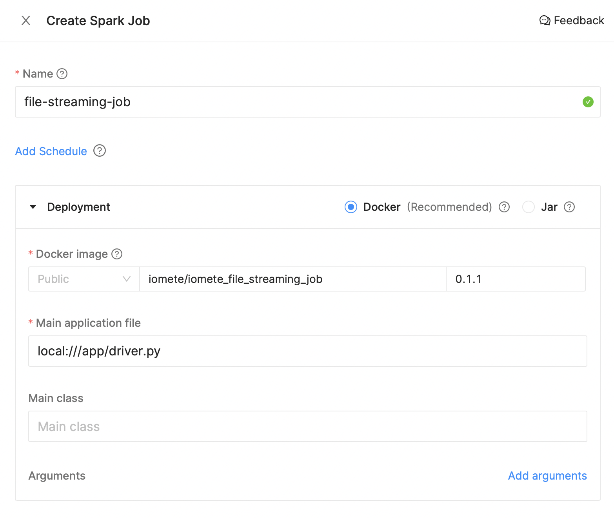
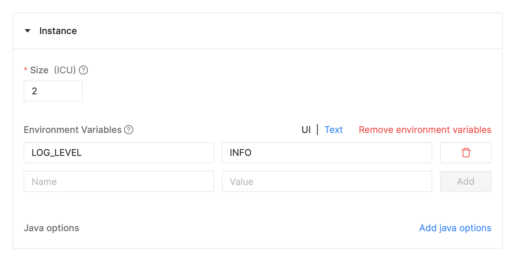
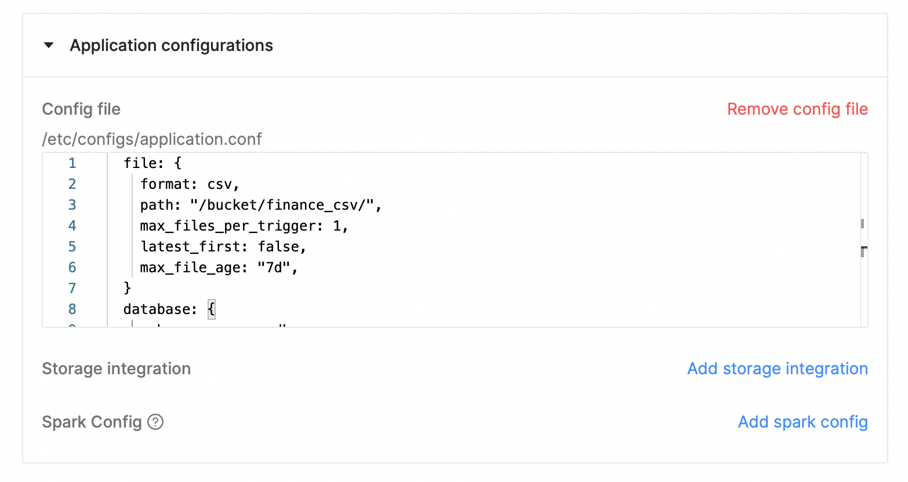

# iomete: File Streaming Job

<p align="center">

</p>

Transfer files to iceberg continuously.

## Table of Contents
 * [File Formats](#file-formats)
 * [Job creation](#job-creation)
 * [Tests](#tests)

## File formats
Tested file formats.
- CSV

## Job creation

- Go to `Spark Jobs`.
- Click on `Create New`.

Specify the following parameters (these are examples, you can change them based on your preference):
- **Name:** `file_streaming-job`
- **Docker Image:** `iomete/iomete_file_streaming:0.1.1`
- **Main application file:** `local:///app/driver.py`
- **Environment Variables:** `LOG_LEVEL`: `INFO` or ERROR
- **Config file:** 
```hocon
{
  source: {
    file: {
      format: json,
      header: true,
      path: /json-path/,
      max_files_per_trigger: 1,
      latest_first: false,
      max_file_age: "7d"
    }
  }
  destination: {
    schema: default,
    table: awesome_orders,
    partitions: []
  }
  processing_time: {
    interval: 5
    unit: seconds # minutes
  }
}
```
## Configuration properties
<table>
  <thead>
    <tr>
      <th>Property</th>
      <th>Description</th>
    </tr>
  </thead>

  <tbody>
    <tr>
      <td>
        <code>file</code><br/>
      </td>
      <td>
        <p>Required properties to connect and configure.</p>
        <ul>
          <li><code>format</code> The format of file.</li>
          <li><code>path</code> The source path to connect file directory</li>
          <li><code>max_files_per_trigger</code> Maximum file number per trigger.</li>
          <li><code>latest_first</code> Whether to process the latest new files first, useful when there is a large backlog of files.</li>
          <li><code>max_file_age</code> Maximum age of files to be processed.</li>
        </ul>
      </td>
    </tr>
    <tr>
      <td>
        <code>database</code><br/>
      </td>
      <td>
        <p>Destination database properties.</p>
        <ul>
          <li><code>schema</code> Specify the schema (database) to store into.</li>
          <li><code>table</code> Specify the table.</li>
        </ul>
      </td>
    </tr>
    <tr>
      <td>
        <code>processing_time</code><br/>
      </td>
      <td>
        <p>Processing time to persist incoming data on iceberg.</p>
        <ul>
          <li><code>interval</code> Processing trigger interval.</li>
          <li><code>table</code> Processing trigger unit: seconds, minutes.</li>
        </ul>
      </td>
    </tr>
</tbody>
</table>

Create Spark Job


Create Spark Job - Instance

>You can use **Environment Variables** to store your sensitive data like password, secrets, etc. Then you can use these variables in your config file using the <code>${ENV_NAME}</code> syntax.



Create Spark Job - Application Config

## If you want to specify schema add schema under to source configuration.
Note: For JSON and sqs data source, schema is required.
```
schema: [
  { name:channel, type:string },
  { name:context, type: struct, properties: [
    {name:library, type: struct, properties: [
      { name:name, type:string },
      { name:version, type:string }
    ]}
  ]},
  { name:receivedAt, type:timestamp }
]
```
## Amazon S3 Source with Amazon SQS (recommended)
If you have a SQS queue listen to bucket, you can define the queue as data source.
```
queue: {
  URL: https://sqs.eu-central-1.amazonaws.com/{account_number}/{queue_name}
  fetch_interval_seconds: 2,
  log_polling_wait_time_seconds: 5
}
```

## Tests

### Prepare the dev environment

```shell
virtualenv .env #or python3 -m venv .env
source .env/bin/activate

pip install -e ."[dev]"
```

### Run test

```shell
python3 -m pytest # or just pytest
```
